  

  
  
  
  

I build software that has to work outside a demo: a robot arm that grabs the right cup, a restaurant system that keeps running when the internet goes down, a market tracker that tells me when my own model isn't good enough to ship.

- Now: vision-guided manipulation for a 6-DOF arm on an assistive mobility platform (internship)
- On the side: an operations platform for independent restaurants
- MS CS at Northwestern, graduating March 2027. Open to full-time roles in robotics, embedded AI and software engineering

## Featured work

<table>
<tr>
<td width="50%" valign="top">

**Vision-guided pick-and-place** · *internship, private*

Real-time instance segmentation and a stereo depth camera on an edge AI computing platform. Hand-eye calibration, camera-to-base transform chain, CAN bus control. 96% grasp success over 28 in-reach trials.

  

</td>
<td width="50%" valign="top">

**Restaurant operations platform** · *private, demo on request*

Seating for a 105-table floor that runs offline on the restaurant LAN, kitchen ordering with LLM document parsing, and a staff time clock with append-only punches.

  

</td>
</tr>
<tr>
<td width="50%" valign="top">

**[cs2-skin-advisor](https://github.com/HenryW0220/cs2-skin-advisor)**

Self-hosted market advisor on Oracle Cloud. Syncs 3 market APIs every hour into a 1.9M-row time-series store and backtests buy/sell signals before they ship.

   

</td>
<td width="50%" valign="top">

**[GROWN](https://github.com/HenryW0220/GROWN)**

Android plant-care app fed by a Raspberry Pi sensor rig (CO2, humidity, temperature, soil moisture), with care advice from the Gemini API.

  

</td>
</tr>
<tr>
<td colspan="2" valign="top">

**RL energy benchmark** · [dreamerv3-zeus](https://github.com/HenryW0220/dreamerv3-zeus) · [tdmpc2-zeus](https://github.com/HenryW0220/tdmpc2-zeus)

Per-step GPU energy of DreamerV3, TD-MPC2, PPO and DQN, measured with Zeus. Finding: TD-MPC2's cost comes from MPPI planning overhead, not model size.

</td>
</tr>
</table>

## Toolbox

  

  

## Activity

<picture>
  <source media="(prefers-color-scheme: dark)" srcset="https://raw.githubusercontent.com/HenryW0220/HenryW0220/output/snake-dark.svg">
  
</picture>
